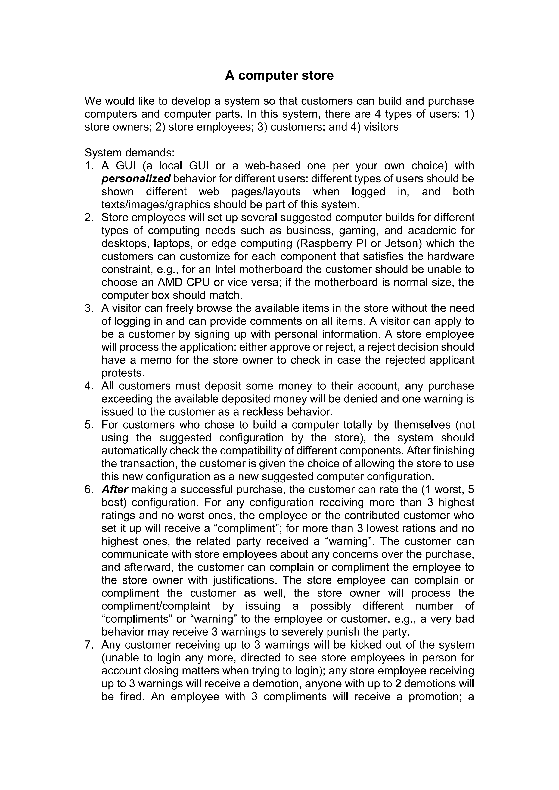

# CSC322
## E-commerce Computer Parts Project 
 The goal of this class project was to use software engineering practices to make a E-commerce platfrom for computer builds and parts that caters to different types of users. We were given [project specifications](#ProjectSpecfifcations) which served as a guideline for what the website needed to have. We created two [ software requirements specification
 ](#SoftwareRequirementsSpecificationDocuments)documents which showcases how we used UML models to plan different components of our website, from use cases to data base and enitity relationships.

 
    
# Project Specfifcations 

# Software Requirements Specification Documents
* [Software Design Report 1](./CSC%20322%20Software%20Requirements%20Specifications%20Report%20.pdf)
* [Software Design Report 2](./CSC%20322_%20Phase%202%20Report.pdf)

# Technologies Used
- HTML5
- CSS3
- JavaScript
- React.js
- Node.js
- MySQL
- AWS RDS

